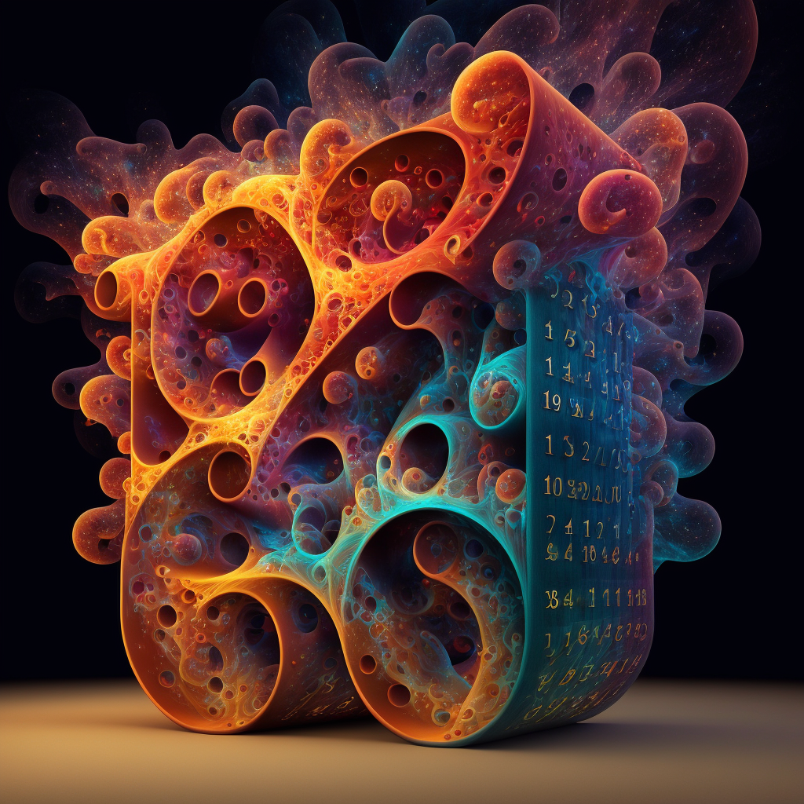

[](https://doi.org/10.5281/zenodo.10206966)
 


# Graduate Student Seminars by Le Chen

## List of seminars

Here is a list of the graduate student seminars that I have delivered in the past few years:

1. [2021-09-27](./2021-09-27/readme.md): Introduction to stochastic partial differential equations
2. [2023-01-18](./2023-01-18/readme.md): Introduction to stochastic heat equation
3. [2023-02-15](./2023-02-15/readme.md): Sharpening your saw before cutting down the tree -- Personal development environment (PDE)
4. [2023-11-01](./2023-11-01/readme.md): Disorderly surface growth

## Reference

If you find this repository useful and want to reference to it, kindly cite it using the following BibTeX entry: 

* Le Chen (2023) “Graduate Student Seminars by Le Chen”. GitHub & Zenodo. https://doi.org/10.5281/zenodo.10206966

```
@misc{chen:23:graduate,
  author        = {Le Chen},
  title         = {Graduate Student Seminars by {Le Chen}},
  month         = {nov},
  year          = {2023},
  publisher     = {GitHub \& Zenodo},
  journal       = {GitHub repository},
  doi           = {10.5281/zenodo.10206966},
  url           = {https://doi.org/10.5281/zenodo.10206966}
}
```

## Acknowledgments
1. Some images are generated using [Midjourney](https://www.midjourney.com/).
2. ChatGPT and GitHub Copilot.

## License

[CC-BY-SA 4.0](LICENSE.txt)
